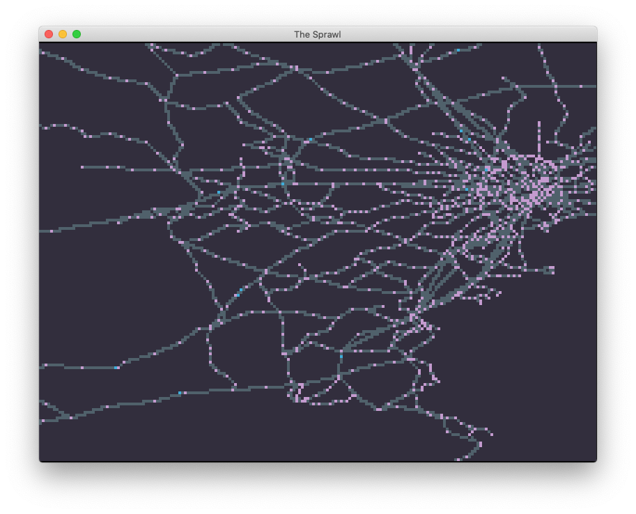

# The Sprawl

## Epigraph

_The Sprawl was a long strange way home over the Pacific now..._

\- _Neuromancer_, William Gibson

## Introduction

Explore Japan's train and subway system at before-seen resolution and accuracy.

## Rising Action

Download Windows and macOS binaries from the [releases page](https://github.com/ktfleming/the-sprawl/releases).

## Falling Action

Click and drag to pan / Mouse wheel to zoom.

## Outroduction

Station and line data from https://ekidata.jp.

## Epilogue

_I grew up in a shotgun row_ 
_Sliding down the hill_ 
_Out front were the big machines_ 
_Steel and rusty now, I guess_ 

\- "The Sprawl", Sonic Youth
